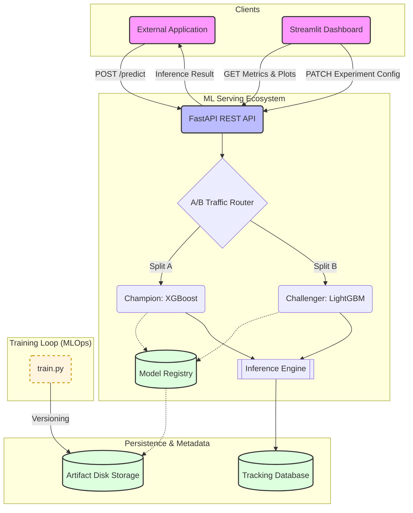

# ModelRouter: A/B Testing & ML Serving Platform

An MLOps-focused model serving platform built with FastAPI. It provides a robust, real-time inference API designed to handle dynamic A/B testing of Machine Learning models (e.g., XGBoost vs. LightGBM). The platform features an intelligent routing engine that splits live traffic between experimental variants, empowering data science teams to safely test model performance in production, monitor metrics, and confidently promote winning models with zero downtime.

## 🏗️ Project Architecture

When a prediction request is received, the API dynamically routes the request based on on-the-fly A/B testing configurations, logs all metrics, and returns the inference result.



## 🚀 Professional MLOps Features

- **Dynamic A/B Routing**: Smoothly transition traffic between Champion and Challenger models via a live dashboard.
- **Automated Deployment**: Training a new model automatically updates the "Latest" model version on the server without code changes.
- **Live Observability**: Real-time tracking of latency, confidence distributions, and traffic distribution.
- **Version Control**: Every model trained is saved with a timestamped version tag for full reproducibility and audit trails.
- **Visual Performance**: Built-in endpoints for serving ROC AUC curves and training-time metrics directly through the API.

## 🚀 Quickstart Guide

Follow these steps to get the server running locally on your machine.

**1. Clone the repository and navigate to the project directory:**
```bash
cd ML_serving_platform
```

**2. Create and activate a Virtual Environment (Windows):**
```bash
python -m venv venv
.\venv\Scripts\activate
```

**3. Install Dependencies:**
```bash
pip install -r requirements.txt
```

**4. Start the FastAPI Server:**
```bash
uvicorn api.main:app
```

**5. Launch the Dashboard (Optional):**
```bash
streamlit run dashboard/app.py
```

## 📚 API Reference

FastAPI automatically generates interactive API documentation. Once the server is running, navigate to:
* **Swagger UI:** [http://127.0.0.1:8000/docs](http://127.0.0.1:8000/docs)

### Core Endpoints:
- `POST /predict`: Principal inference endpoint with dynamic model routing.
- `GET /models/auc`: Returns training-time metrics for all active models.
- `GET /models/roc_curve`: Serves the ROC curve comparison plot for the current versions.
- `PATCH /experiments/{id}/split`: Real-time adjustment of traffic percentages.
- `POST /experiments/{id}/promote`: End an experiment and promote a winning model to 100% traffic.

### Example: Making a Prediction via `cURL`
```bash
curl -X 'POST' \
  'http://127.0.0.1:8000/predict' \
  -H 'accept: application/json' \
  -H 'Content-Type: application/json' \
  -d '{
  "features": {
    "Age": 65,
    "Prior Fractures": 1,
    "Family History": 1,
    "Gender": 0,
    "Vitamin D Intake": 0,
    "Physical Activity": 1
  },
  "experiment_id": "exp_001"
}'
```

## 📊 Dashboards & Visualizations

📈 **Model Performance Overview**


*(Add screenshots of your live Streamlit dashboard and Swagger UI here!)*

---
> **Tech Stack:** Python, FastAPI, Streamlit, SQLite, XGBoost, LightGBM, Pandas, Scikit-learn, Mermaid.js.
